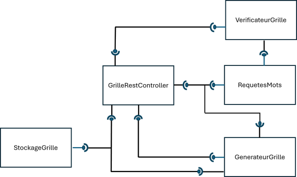

# Exemple avec un code qui genere des grilles de mots mêlés, à base de services web

le principe : les "générateurs de grille" recherchent des "words-service" en passant par un annuaire :
- Seul l'annuaire à une IP connue (fixe).
- les autres services s'enregistrent auprès de l'annuaire
- l'adresse de l'annaire est paramétrable au lancement de l'application
- "générateurs de grille" utilise 2 chemins : /langues et /{langue}/unmot/longueur/{longueur} de "words-service"
- les contrats des services (leurs apis) sont disponibles à <url-du-service>/swagger-ui.html
- il y a une sorte d'abonnement entre services via l'annuaire

## Quelques commandes :  


```
###################################################### avec maven ######################################################
################ sous windows, il ne faut pas taper ceci dans powsershell (configurer vscode et intellij ###############
###################### sous windows, dans le terminal, utilisez "chcp 65001" pour passer en utf-8 ######################

mvn clean install
mvn spring-boot:run -Dspring-boot.run.jvmArguments='-Dserver.port=8123'  -pl annuaire
mvn spring-boot:run -Dspring-boot.run.jvmArguments='-Dserver.port=8241' -Dspring-boot.run.arguments='http://localhost:8123/' -pl words-service
mvn spring-boot:run -Dspring-boot.run.jvmArguments='-Dserver.port=8275' -Dspring-boot.run.arguments='http://localhost:8123/' -pl words-service
mvn spring-boot:run -Dspring-boot.run.jvmArguments='-Dserver.port=8888' -Dspring-boot.run.arguments='http://localhost:8123/' -pl generateurgrille
mvn spring-boot:run -Dspring-boot.run.jvmArguments='-Dserver.port=9999' -Dspring-boot.run.arguments='http://localhost:8123/' -pl generateurgrille

##################################################### avec docker ######################################################
#construire les images docker 
docker build -t gg:annuaire annuaire
docker build -t gg:words words-service
docker build -t gg:gg generateurgrille

#construire les container
docker create --name annuaire8123 -p 8123:8123  -e PORT=8123 gg:annuaire
docker create --name ws1 -p 8222:8222  -e IP_ANNUAIRE="http://host.docker.internal:8123/"  -e PORT=8222 gg:words
docker create --name ws2 -p 8244:8244  -e IP_ANNUAIRE="http://host.docker.internal:8123/"  -e PORT=8244 gg:words
docker create --name gg1 -p 8333:8333  -e IP_ANNUAIRE="http://host.docker.internal:8123/" -e PORT=8333 gg:gg
# avec --add-host=host.docker.internal:host-gateway pour linux pour les host.docker.internal

#lancement en daemon
docker start annuaire8123
docker start ws1
docker start gg1

#pour arreter le service dans ws1 (et le container par consequence)
# docker exec ws1 pidof java 
# docker exec ws1 bash -c "kill 7"
docker exec ws1 bash -c "kill $(pidof java)"

docker stop -t 0 gg1
docker stop -t 0 annuaire8123

docker logs annuaire8123
docker logs ws1
docker logs ws2
docker logs gg1

################################################# avec docker-compose ##################################################
###################################### les images sont construites comme avant #########################################
docker-compose up --scale ws=3 --scale gg=2
#ordre aléatoire
docker exec exempleannuairemotsmeles-ws-2 bash -c "kill $(pidof java)"
docker exec exempleannuairemotsmeles-ws-1 bash -c "kill $(pidof java)"
docker exec exempleannuairemotsmeles-ws-3 bash -c "kill $(pidof java)"
docker-compose stop 

################################################### pour la page web ###################################################
cd front
npm install
node server.js

############################################# pour la page web dans docker #############################################
#depuis la racine du projet
docker build -t gg:front front
docker create --name front80 -p 80:80  -e URL_GENERATEUR="http://localhost:8888"  gg:front
docker start front80

# ou avec docker-compose (on est dans ./front)
cd front
docker-compose  -f docker-compose-withui.yml up
# l'accès se fait sur http://localhost dans les deux cas


####################################################### IT CASE ########################################################
##################################################### PARTIE DOKER #####################################################
docker network create --subnet=172.42.0.0/16 netITCase
docker build -t gg:words words-service
docker build -t gg:gg generateurgrille
docker create --net netITCase --ip 172.42.0.243 --name ws-ip-172.42.0.243 -p 8180:8180  -e IP_ANNUAIRE="http://host.docker.internal:8024/"  -e PORT=8180 gg:words
docker create --net netITCase --ip 172.42.0.245 --name gg-ip-172.42.0.245 -p 8280:8280  -e IP_ANNUAIRE="http://host.docker.internal:8024/"  -e PORT=8280 gg:gg
docker create --net netITCase --ip 172.42.0.233 --name ws-ip-172.42.0.233 -p 8181:8181  -e IP_ANNUAIRE="http://host.docker.internal:8025/"  -e PORT=8181 gg:words
docker create --net netITCase --ip 172.42.0.235 --name gg-ip-172.42.0.235 -p 8281:8281  -e IP_ANNUAIRE="http://host.docker.internal:8025/"  -e PORT=8281 gg:gg
################################################### LANCEMENT DES IT ###################################################
mvn failsafe:integration-test failsafe:verify  -pl annuaire
## /!\ attention, ip importante, choisir celle du test ou modifier dans le fichier .json /!\ 
## /!\ contrat envoyé avec des versions selon l'OS, fichier en double dans les ressources, par défaut pour windows /!\ 


```


## Infos sur les versions :

- commit initial
- tag codeinitial : 3 services, dont un annuaire. Il n'y a des exemples de tests que dans annuaire
    - un exemple de test d'un composant indépendant : ServiceEnregistrementImplTest teste quand un service doit être "oublié/retiré" de l'annaire (test en boite grise)
    - un exemple de test d'un composant avec des dépendances (et des @MockBean) ServiceAbonnementImplTest test quand un service s'arrête, avec différents cas : avec ou sans abonnement, avec ou sans abonné
    - un exemple de test avec des appels à des services extérieurs simulés avec MockWebServer : RequeteVersAbonnesImplTest
    - un exemple de test de sa propre API (avec mockmvc) dans AnnuaireControlleurWebTest
    - un exemple de test "scenario", ou tout le service est testé, mais l'extérieur est simulé (c.f. les deux tests précédents)
- tag ciinit : mise en place de la githubaction
- tag dockerfile : les Dockerfile, utilisables avec le binding de port, si les services s'enregistrent bien avec des IP qui ne sont pas "localhost"
  - pour l'exécution de docker dans github action : les containers sont lancés en tâche de fond (daemon),
  - il y a des "sleep" pour laisser le temps d'exécution (c'est probablement plus lent sur la VM de github qu'en local)
  - pour l'utilisation de docker avec host.docker.internal il faut l'option "--add-host=host.docker.internal:host-gateway" car c'est sur linux
  - il y a des commandes exécutées dans un des containers docker pour simuler l'arrêt d'un service
  - le pipeline s'arrête car les containers docker sont lancés en tâche de fond (les stops ne sont pas nécessaires)
  - le commit 253fe609d6c813204ff52112d48c3c866ffe24ad permet de ne plus avoir un "magical number" pour un numéro de processus java 
- tag dockercompose : il y a un docker compose qui permet de tout lancer d'un coup
  - le compose est lancé (pas en fond), il bloque,
  - mais un script est lancé en tâche de fond, qui fait un "sleep" puis qui arrête le compose
  - l'ordre pour "tuer" les words-services est complétement arbitraire 
  - les docker-compose up ou stop fonctionne avec le fichier yml qui est là où la commande est lancée
  - le commit 253fe609d6c813204ff52112d48c3c866ffe24ad permet de ne plus avoir un "magical number" pour un numéro de processus java
- tag ui : il y a une page web (hébergée sur un serveur node) qui demande à un générateur de grille une grille pour l'afficher
  - il y a un docker dans ./front et un docker-compose spécifique
  - la page est accessible par un binding de port sur localhost de la machine hôte (sinon, il faut des configurations réseaux complexes...)
- tag IT : il y a des tests d'intégration.
  - docker est piloté depuis le test avec des commandes systèmes : Runtime.getRuntime().exec()
  - pour lancer les ITCase, il faut bien ajouter failsafe:verify, sinon une erreur dans les tests fara tout de même un "BUILD SUCCESS"
  - c'est découpé en deux avec des ports et des adresses différentes pour ne pas avoir les problèmes de libération de port différée


## Annuaire en composant 

C'est découpé en 4 :
```
                        1) savoir si un service est déjà connu + obtenir la liste des services 2) enregistrer un service, 3) recherher un chemin
AnnuaireRestController ────C•────────────ServiceEnregistrement
   |                                            |
   |                                            •   1) savoir si un service est déjà connu
   |                                            U   2) retitrer un service
   |                                            |
   └ ────────────────────C•───────────────ServiceAbonnement────────────C•──────────RequetesVersAbonnes 
                                1) ajouter un abonnement                    1) prevenir des abonnés
                                2) retirer un abonnement
                                    
   
   ──C ou U : un requis 
          |
          
   • : un fourni
```

Note 
 - on peut faire des interfaces pour les composants
 - on pourrait aussi casser en deux l'interface pour "ServiceEnregistrement", une pour chaque usage
 - on peut aussi inverser le lien entre les deux @Service, mais comme ServiceAbonnement a besoin de savoir si les services sont référencés, cela ferait un cycle (SA <--> SE). C'est possible, il faut alors dans le fichier applications.properties mettre spring.main.allow-circular-references=true.
 - dans le cas précédent, décomposer ServiceAbonnment en 2 interfaces (une pour le RestController l'autre pour ServiceEnregistrement est très pertinent)


## words-service en composant 


C'est découpé en 4 composants :
```
                        1) ajout d'une langue, 2) lister les langues
WordsRestController ────C•────────────DicoImportExport
 |  |                                            |
 |  |                                            •   1) savoir si une langue est dispo
 |  |                                            U   2) récupérer son dictionnaire
 |  |                                            |
 |  └ ────────────────────C•───────────────WordsService
 |                               1) un mot au hasard, un mot avec une taille précise
 |                              2) les anagrammes
 |                                   
 |
 └ ────────────────────C•───────────────WordsServiceCheck
   
   ──C ou U : un requis 
          |
          
   • : un fourni
```


## generateur de grille en composant 



